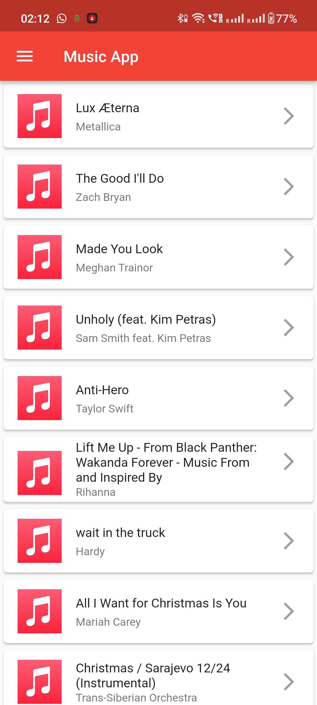
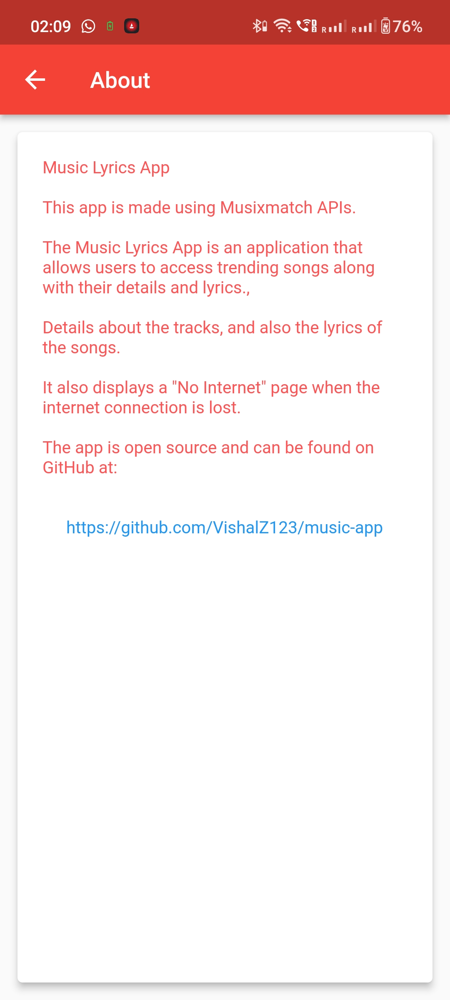
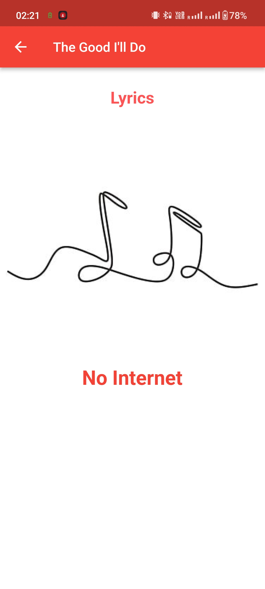

# Music Lyrics App

The Music Lyrics App is an application that allows users to access trending songs along with their details and lyrics. It utilizes the Musixmatch APIs to fetch the necessary information. This README provides an overview of the project and instructions for setting it up locally.

## Features

The main features of the Music Lyrics App include:

1. Retrieving a list of trending songs from the Musixmatch charts.tracks.get API.
2. Obtaining the details of a selected track using the Musixmatch track.get API.
3. Fetching the lyrics of the selected track using the Musixmatch track.lyrics API.
4. Handling internet connection loss and displaying a "No Internet" page to the user.
5. Implementing the BLoC (Business Logic Component) pattern for efficient state management.

## Setting Up Locally

To run the Music Lyrics App locally, follow these steps:

1. Clone the repository to your local machine.
2. Open the [trackBLoC.dart](./lib/trackBLoC.dart) file located in the project.
3. Locate line 6 of the file and replace `'YOUR_API_KEY_HERE'` with your actual Musixmatch API key.

   ```dart
   const String API_KEY = 'YOUR_API_KEY_HERE';
   ```
5. Ensure that you have Flutter and its dependencies installed on your machine.
6. Open a terminal or command prompt and navigate to the project directory.
7. Run the app on an emulator using the command flutter run.

Please note that you need to have a valid Musixmatch API key to use the app. If you don't have one, you can obtain it by signing up on the [Musixmatch developer portal](https://developer.musixmatch.com/).

---
## Screenshots
<div align='center'>





</div>
