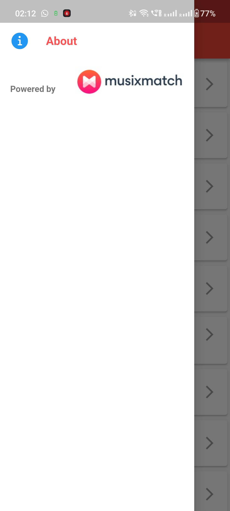

# Music App

A Music App for getting trending Songs along with their details and Lyrics.

Musixmatch APIs are used for for the purpose of getting details and lyrics.
The main features of the app are as follows:

- Get the list of trending songs from the musixmatch *charts.tracks.get* API.
- Get the details of a selected track using the musixmatch *track.get* API.
- Get the lyrics of the selected track using the musicmatch *track.lyrics* API.
- Respond to the internet connection loss and show a 'No Internet' page.
- The App is made using the **bloc pattern**.
## Setting this locally
- Clone the repository.
- Insert your API KEY, in [trackBLoC.dart](./lib/trackBLoC.dart) at `line 6`. 
`const String API_KEY = 'YOUR_API_KEY_HERE';`
- Run the app on emulator using `flutter run` in terminal.
## Screenshots

